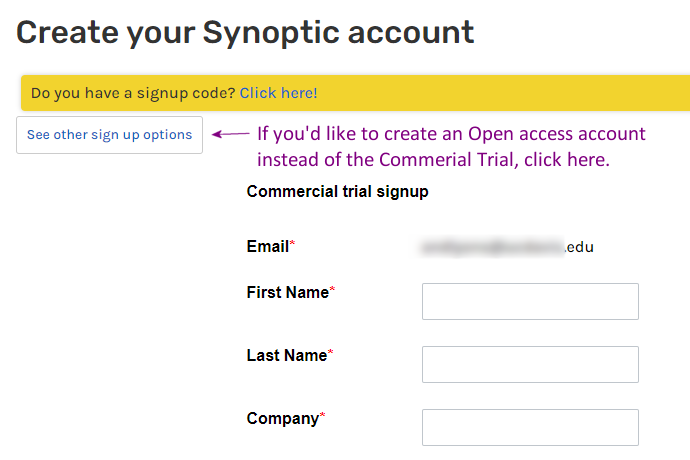

# Building a Degree Day Decision Support Tool in R: WELCOME!

Thank you for registering for the [Building a Degree Day Decision Support Tool in R](https://igis.ucanr.edu/Training/DegreeDayDST_May24/) workshop series. 

1. You should have already received a __Google calendar invite__ for the workshop, including a Zoom link. If you haven't received the Zoom link by the morning of the workshop, please contact the instructor.

2. The workshop materials will be available at <https://ucanr-igis.github.io/degday-shiny/>. Recordings will be posted on the website as they become available.

3. If you'd like to complete the hands on exercises (optional), please make sure you have a free account on [Posit Cloud](https://posit.cloud/) (formerly known as RStudio Cloud), **before** the workshop starts. Posit Cloud allows you to run RStudio in a browser. On the day of each workshop, I'll share a link to a RStudio Project on Posit Cloud that you can clone, containing all the packages, data, and exercises ready-to-go.

*RStudio Desktop power users*: you are welcome to use RStudio Desktop on your laptop, with the caveat that no setup help will be available during the workshop. Please make sure you have all the [required packages](https://github.com/UCANR-IGIS/degday-shiny-s24/blob/main/scripts/install_packages.R) installed.
At the start of the workshop I'll share a URL to a zip file that you can use to download an RStudio Project with all the exercises and data ready-to-go.

4. For workshop #2 & #3, the exercises will include downloading "real time" weather data via the [Synoptic Data](https://synopticdata.com/) API. You are welcome (but not required) to create your own API token on Synoptic. 

a. Start here: <https://customer.synopticdata.com/>

b. Enter the code they email you to verify your email address

c. If you have a .edu email, and would like to create an open-access account (recommended), click on the 'See other sign up options' button and select the 'Open Access Program' sign-up link. The free commercial account will work fine also.

d. Complete the form and Submit

e. On the 'Customer Console' page, click on 'Data Credentials', then create 1) a private key, then 2) a public token. Record your public token somewhere.

\

5. If possible I highly recommend a **second monitor** for the hands-on exercises, so you can view the instructor's screen in one monitor while you work on RStudio on the other. A tablet or second laptop could suffice as your 'Zoom' device while you run RStudio Cloud on your laptop. If you're limited to just one screen (hopefully a big one), check out [these tips](https://ucanr-igis.github.io/caladaptr-res/workshops/ca_intro_feb22/workspace_tips.html) for viewing Zoom and an application window side-by-side.

Thanks and if you have any questions please let me know.

Best,\
Andy Lyons\
Instructor
